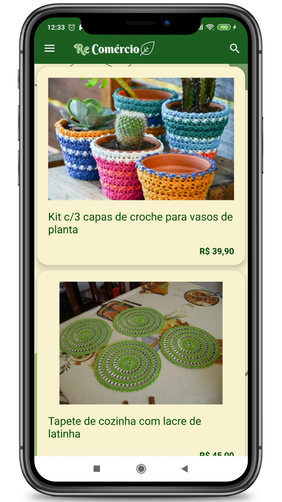
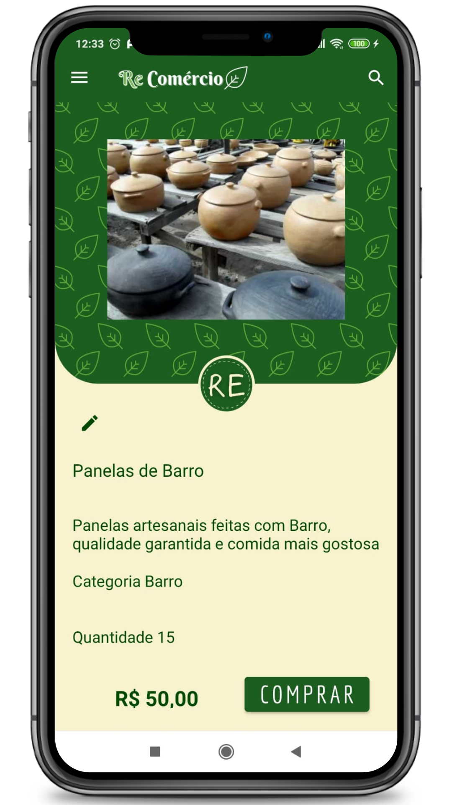

<div align="center">
    
    <h1>Recomércio </h1>
</div>

## 📔 Sobre:

### Recomércio
- O Recomércio é um e-commerce tem como objetivo dar a oportunidade de renda autônoma variável para as pessoas de todas as classes, utilizando de recursos recicláveis ou dispensáveis sendo em venda direta do produto bruto ou realizando algum tipo de artesanato.
#### Tema a ser trabalhado
- Criar alternativa viável para que pessoas  resgatem suas fontes de renda, além de promover a conservação do meio ambiente pela reutilização dos materiais em circulação.
#### Como?
- Com a criação de uma plataforma que facilita a venda de artesanatos e materiais recicláveis. Possibilitando a venda de forma mais rápida e mais rentável.
#### Por que?
- O fortalecimento da cadeia de reciclagem gera benefícios econômicos e ambientais para todo o Brasil, e o aumento na produtividade gera renda para milhares de famílias.


### Integrantes do grupo de desenvolvimento:</br></br>

- [Gabriele Viana](https://github.com/Gabigrr)
- [Celina Alcantara](https://github.com/celinaalcantara)
- [Steve Harris](https://github.com/SPDHRRS)
- [Pedro Carvalho](https://github.com/PedroHFCarvalho)

---

## 🔧 Técnologias:

### Este projeto foi realizado com as seguintes técnologias:</br></br>

- [Koltin](https://developer.android.com/kotlin?hl=pt&gclid=CjwKCAjwur-SBhB6EiwA5sKtjqqD7CUMO-P4lTkdJpHbCGsZkv7UMkFa_pZGpxIT9G-hevWeYJoipBoC0IMQAvD_BwE&gclsrc=aw.ds)
- [Hilt](https://developer.android.com/training/dependency-injection/hilt-android?hl=pt-br)
- [Glide](https://github.com/bumptech/glide)
- [Retrofit](https://square.github.io/retrofit/)
- [ViewBinding](https://developer.android.com/topic/libraries/view-binding)

---

## 📝 Funcionalidades:

- Tela de Login e/ou Cadastro no app
<div align="left">
    
</div>
</div>

- Homepage
<div align="left">
    
</div>

- Tela do anúncio pronto
<div align="left">
    
</div>

- Cadastro do produto/anúncio
- Tela de Login e/ou Cadastro no app
- Tela de cadastro
- Edição e exclusão do anúncio 
- Homepage
- Recuperação de senha
- Preview do produto

## 🚀 Como Executar:

Clone a aplicação:

```bash
$ git clone https://github.com/PedroHFCarvalho/Projeto_Integrador
```

